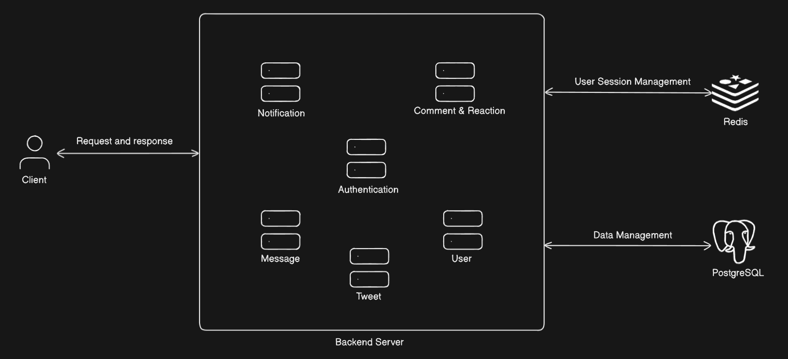
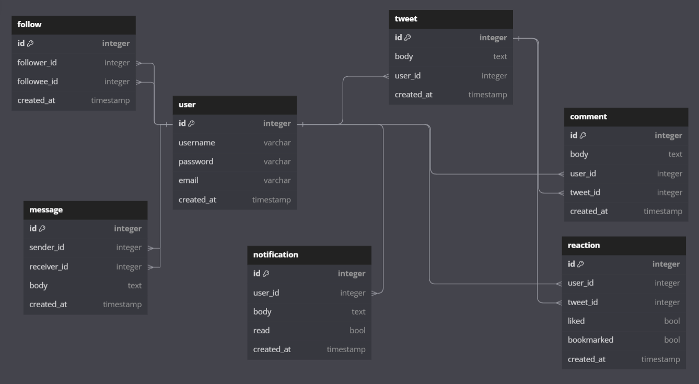

# Twitter
> This fully asynchronous Twitter backend project is a REST API that supports essential features like user 
> management, tweeting, commenting, reacting, messaging, and following. It uses Redis for user authentication
> and PostgreSQL for data storage.

## Architecture Diagram



## Database Schema



## Technology stack
- Python
- FastAPI
- PostgreSQL
- Redis
- Docker


## Project Structure
```
backend
│   .gitignore
│   docker-compose.yml
│   Makefile
│   README.md
│   requirements.txt
│   ruff.toml
│
├───app
│   │   errors.py
│   │   main.py
│   │   middlewares.py
│   │   models.py
│   │   openapi.py
│   │   router.py
│   │   settings.py
│   │   utils.py
│   │   __init__.py
│   │
│   ├───auth
│   │       depends.py
│   │       models.py
│   │       router.py
│   │       service.py
│   │       __init__.py
│   │
│   ├───comment
│   │       models.py
│   │       orm.py
│   │       router.py
│   │       service.py
│   │       __init__.py
│   │
│   ├───database
│   │   │   __init__.py
│   │   │
│   │   ├───postgres
│   │   │       core.py
│   │   │       orm.py
│   │   │       __init__.py
│   │   │
│   │   └───redis
│   │           core.py
│   │           __init__.py
│   │
│   ├───exc
│   │       core.py
│   │       handlers.py
│   │       utils.py
│   │       __init__.py
│   │
│   ├───follow
│   │       errors.py
│   │       models.py
│   │       orm.py
│   │       router.py
│   │       service.py
│   │       __init__.py
│   │
│   ├───message
│   │       errors.py
│   │       models.py
│   │       orm.py
│   │       router.py
│   │       service.py
│   │       __init__.py
│   │
│   ├───notification
│   │       models.py
│   │       orm.py
│   │       router.py
│   │       service.py
│   │       __init__.py
│   │
│   ├───reaction
│   │       models.py
│   │       orm.py
│   │       router.py
│   │       service.py
│   │       __init__.py
│   │
│   ├───tweet
│   │       errors.py
│   │       models.py
│   │       orm.py
│   │       router.py
│   │       service.py
│   │       __init__.py
│   │
│   └───user
│           errors.py
│           models.py
│           orm.py
│           router.py
│           service.py
│           __init__.py
│
└───tests
        __init__.py
```


## How to run application locally
1. Install docker desktop
2. Create a virtual environment ```python -m venv .venv```
3. Enter virtual environment and install all dependencies ```pip install -r requirements.txt```
4. Spin up Postgres and Redis ```docker compose up```
5. Start application server ```make run```
6. Open up your browser and go to http://localhost:8000/docs